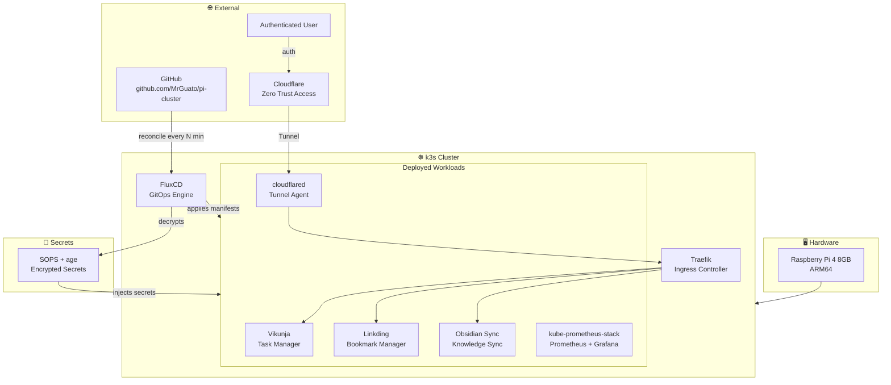
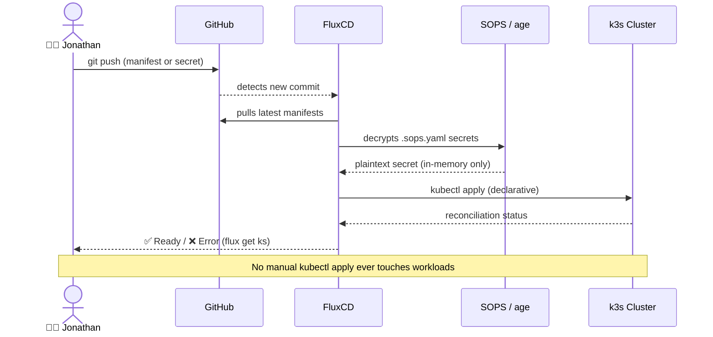
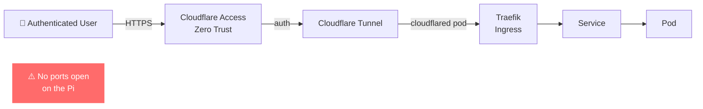

[](https://github.com/MrGuato)
[](https://github.com/MrGuato/pi-cluster/commits)
[](https://github.com/MrGuato/pi-cluster)
[](https://github.com/MrGuato/pi-cluster/pulse)
[](https://k3s.io/)
[](https://fluxcd.io/)
[](https://www.arm.com/)
[](https://www.raspberrypi.com/)
[](https://github.com/mozilla/sops)
[](https://www.cloudflare.com/products/tunnel/)
[](https://github.com/MrGuato/pi-cluster)
[](https://github.com/prometheus-community/helm-charts)

# pi-cluster
**Raspberry Pi k3s Kubernetes Cluster — GitOps with FluxCD**

This repository tracks the full lifecycle of my **Raspberry Pi–based Kubernetes cluster**, managed entirely using **GitOps** principles with **FluxCD**.

This is not a "toy" home lab. It is a **serious learning environment** designed to mirror how production Kubernetes clusters are built, operated, and evolved.

> *"If it's not committed, it doesn't exist."*

## Project Goals

This project exists to:

- Learn **Kubernetes the right way**: declarative, auditable, reproducible
- Practice **GitOps-first cluster management** with FluxCD
- Build production-style security patterns on minimal hardware
- Self-host real, useful applications, not just demos
- Treat a Raspberry Pi like a real platform, not a sandbox

**Inspired and taught by:**
**[Mischa van den Burg](https://mischavandenburg.com/)** — Microsoft MVP, Kubestronaut, and Cloud Native engineer whose homelab approach, teaching style, and GitOps-first philosophy directly shaped how this cluster is built and operated.

## Core Principles

| Principle | What it means here |
|---|---|
| **Git is the source of truth** | No manual `kubectl apply` for workloads, ever |
| **Declarative over imperative** | All state lives in YAML, not in someone's head |
| **Secrets are encrypted at rest** | SOPS + age; no plaintext secrets in the repo |
| **No unnecessary exposure** | Cloudflare Tunnels only, no open inbound ports |
| **Small cluster, production mindset** | Security-conscious configs, intentional defaults |
| **Understand before applying** | Every change is made manually and committed intentionally |

## Architecture

### Cluster Overview



### GitOps Reconciliation Flow



### External Access Flow



## Deployed Applications

| App | Purpose | Access | Notes |
|---|---|---|---|
| [Vikunja](https://vikunja.io/) | Task and project management | Cloudflare Tunnel + ZT | Public URL config required for CORS |
| [Obsidian LiveSync](https://github.com/vrtmrz/obsidian-livesync) | Obsidian vault sync with self-hosted CouchDB backend | Cloudflare Tunnel + ZT | CouchDB is bundled as part of this deployment |
| [Linkding](https://github.com/sissbruecker/linkding) | Bookmark manager | Cloudflare Tunnel + ZT | First deployed app |
| [kube-prometheus-stack](https://github.com/prometheus-community/helm-charts/tree/main/charts/kube-prometheus-stack) | Cluster monitoring with Prometheus and Grafana | Internal (`kubectl port-forward`) | Deployed via Helm chart through FluxCD |
| [cloudflared](https://github.com/cloudflare/cloudflared) | Cloudflare Tunnel agent | Outbound only | Handles all external access |

## Secrets and Encryption

Secrets are **never stored in plaintext**. Every secret in the repo is encrypted with [SOPS](https://github.com/mozilla/sops) using an [age](https://age-encryption.org/) key before being committed. Flux holds the age key and is the only component that decrypts secrets at apply time. Running `kubectl apply` directly on a `.sops.yaml` file will create a broken Kubernetes Secret full of ciphertext — decryption only happens through Flux.

The age key itself lives at the repo root as `age.agekey` and is gitignored. The SOPS config at `clusters/staging/.sops.yaml` tells SOPS which age recipient to encrypt to.

## Repository Structure

```text
.
├── clusters/
│   └── staging/
│       ├── .sops.yaml              # SOPS encryption config (age recipient)
│       ├── flux-system/            # Flux bootstrap manifests
│       └── apps.yaml               # Flux Kustomization pointing to apps/staging/
│
├── apps/
│   ├── base/                       # Environment-neutral app definitions
│   │   ├── vikunja/
│   │   │   ├── namespace.yaml
│   │   │   ├── deployment.yaml
│   │   │   ├── service.yaml
│   │   │   ├── configmap.yaml
│   │   │   └── kustomization.yaml
│   │   ├── obsidian-livesync/
│   │   ├── linkding/
│   │   ├── cloudflared/
│   │   └── monitoring/
│   │       ├── namespace.yaml
│   │       ├── helmrepository.yaml  # prometheus-community Helm repo
│   │       ├── helmrelease.yaml     # kube-prometheus-stack HelmRelease
│   │       └── kustomization.yaml
│   │
│   └── staging/                    # Environment overlays (patches, secrets, replicas)
│       ├── vikunja/
│       │   ├── kustomization.yaml
│       │   └── secret.sops.yaml    # Encrypted, Flux decrypts at apply time
│       ├── obsidian-livesync/
│       ├── linkding/
│       ├── monitoring/
│       └── cloudflared/
│           └── secret.sops.yaml    # Tunnel token, encrypted with age
│
├── age.agekey                      # ⚠️ gitignored, never committed
└── README.md
```

> `apps/base/` holds environment-neutral manifests. `apps/staging/` holds overlays: patches, replica counts, and encrypted secrets. Flux auto-discovers any subfolder containing a `kustomization.yaml`.

## Hard-Won Lessons

A few things that burned time and are worth documenting:

**Secret name mismatches cause silent failures.**
If your Cloudflare tunnel `Secret` is named `tunnel-credentials` in the manifest but `cloudflared-credentials` in the secret file, Flux will reconcile successfully — the pod just will not start. Always verify name consistency across all manifests referencing a secret.

**SOPS-encrypted secrets cannot be applied with `kubectl` directly.**
Only Flux (with the age key loaded) can decrypt them. Running `kubectl apply -f secret.sops.yaml` will create a broken secret full of ciphertext. This is by design.

**`SOPS_AGE_KEY_FILE` or `--config` is required when `.sops.yaml` is not at the repo root.**
The `.sops.yaml` config lives at `clusters/staging/`. Any manual `sops` operations need to point there explicitly, or the wrong key will be used.

**`VIKUNJA_SERVICE_PUBLICURL` is not optional.**
Vikunja requires the public URL set in its ConfigMap. Without it, the frontend makes requests to a relative path that the browser blocks as a CORS violation. External access will appear broken even though the pod is healthy.

## Acknowledgements

This project was built while learning from **[Mischa van den Burg](https://mischavandenburg.com/)**, Microsoft MVP, Kubestronaut, and Cloud Native engineer. His homelab approach, GitOps-first philosophy, and genuine love for the craft directly shaped how this cluster is built and operated.

> *"Linux. Kubernetes. Automation. Security. Master these four. Work anywhere."*
> — Mischa van den Burg

<details>
<summary>📋 Cluster Quick Reference</summary>

```bash
# Check Flux reconciliation status
flux get kustomizations

# Watch all pods across namespaces
kubectl get pods -A

# Force Flux to reconcile immediately
flux reconcile kustomization apps --with-source

# Check a specific app
kubectl get all -n vikunja

# Access Grafana locally
kubectl port-forward -n monitoring svc/kube-prometheus-stack-grafana 3000:80

# Tail Flux controller logs
kubectl logs -n flux-system deploy/kustomize-controller -f

# Decrypt a secret for inspection (requires age key)
SOPS_AGE_KEY_FILE=./age.agekey sops --config clusters/staging/.sops.yaml -d apps/staging/cloudflared/secret.sops.yaml
```

</details>
